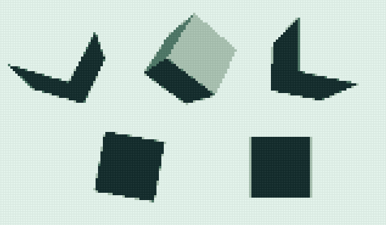

Gameboy Effect
======

This is an example Unity3D project that pixelates the output and quantizes to four colors, to look like a Game Boy game.

It uses [OnRenderImage](https://docs.unity3d.com/ScriptReference/Camera.OnRenderImage.html), [Graphics.Blit](https://docs.unity3d.com/ScriptReference/Graphics.Blit.html) and a custom shader for the effect itself.

Previously, Unity3D free didn't have Image Effects, so this effect was implemented by grabbing the framebuffer using [ReadPixels](http://docs.unity3d.com/ScriptReference/Texture2D.ReadPixels.html), drawing a screen filling quad using [straight GL](http://docs.unity3d.com/ScriptReference/GL.html) and postprocessing using the same shader. It was *very* inefficient.

Feel free to use this however you want for any kind of project, no need to attribute or ask permission. But I'd love to know if you use it, you can reach me at [@sergilazaro](http://twitter.com/sergilazaro).

Usage
======

In order to use this in your project, you just need PixelatedEffect.cs and pixel.shader. Attach the PixelatedEffect script to the camera, and link the Shader to it. You might also want to remove the OnGUI button.

If you choose a factor of 4x to upscale, and you want a game resolution of e.g. 160x144 (Game Boy), you need to set the Unity resolution to 4 times that value, so 640x576.